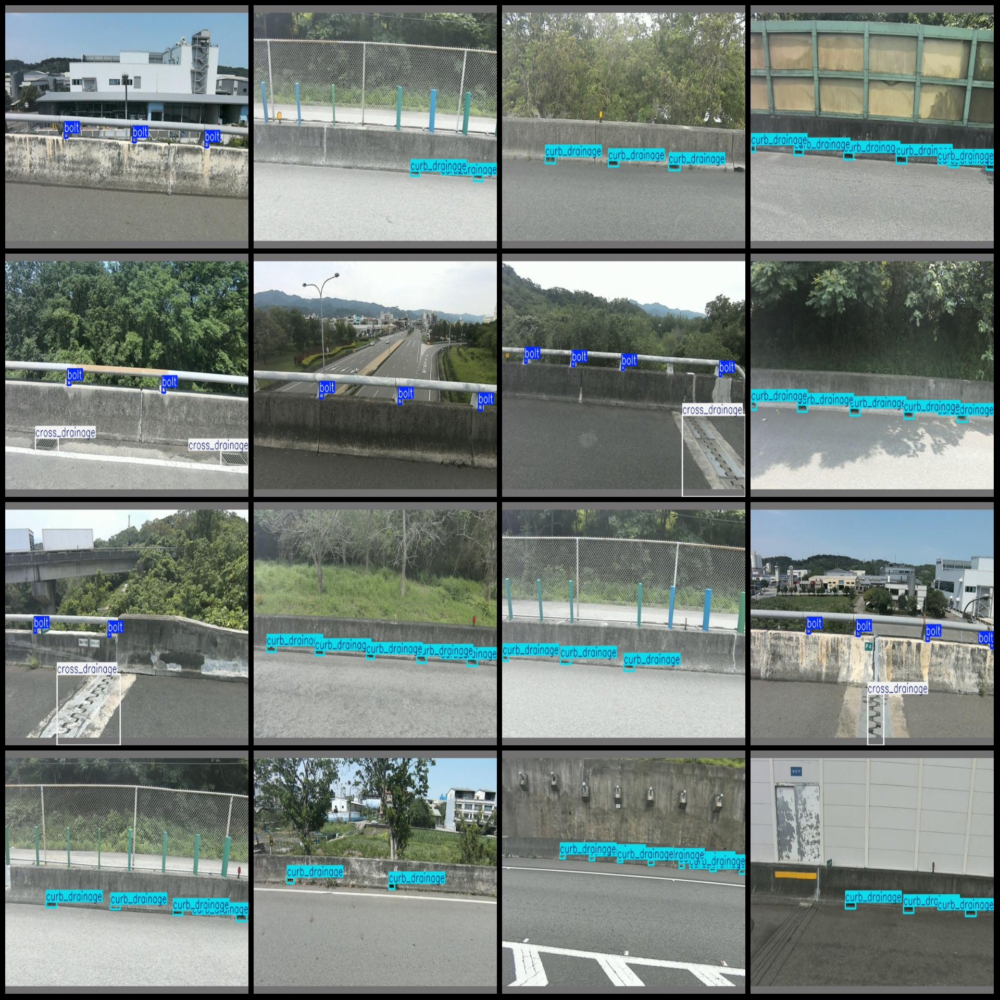
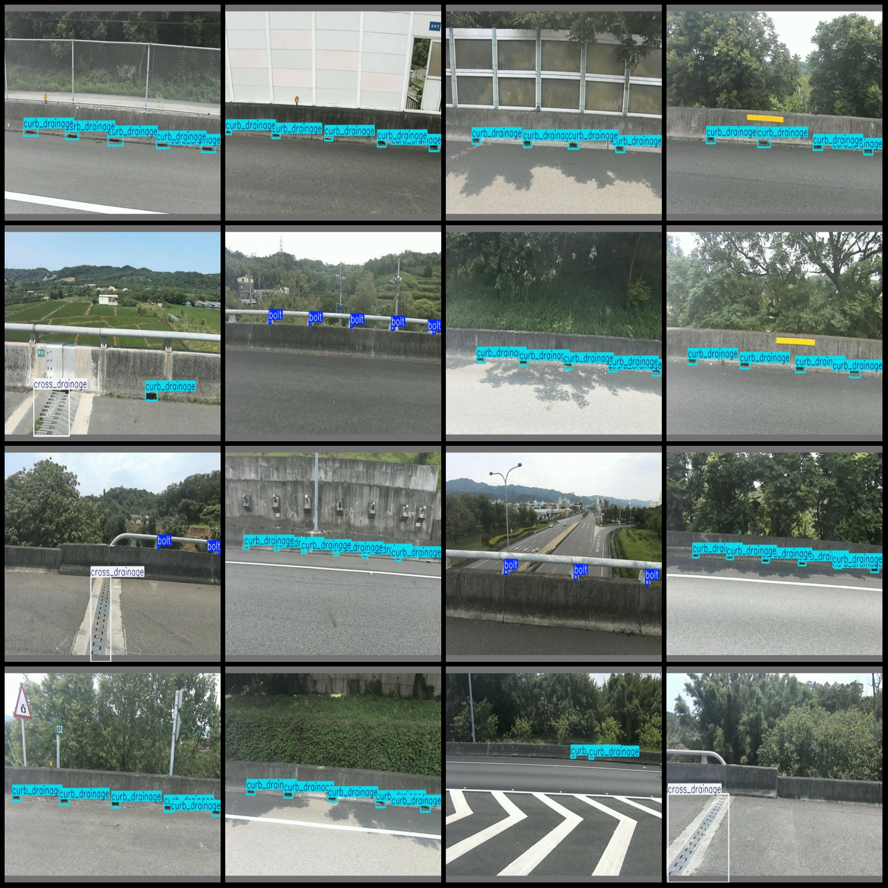

# Smart Bridge Drainage Detection Dataset: Pascal VOC+YOLO Format with 1386 Images in 3 Categories

The dataset format is: Pascal VOC format + YOLO format (txt files without split paths, only containing jpg images and corresponding VOC format xml files and yolo format txt files).

Number of images (jpg file count): 1386
Number of annotations (xml file count): 1386
Number of annotations (txt file count): 1386
Number of categories: 3
Label names according to the yolo format category order (not consistent with this list, but refer to the labels folder classes.txt): ["bolt", "cross_drainage", "curb_drainage"]
Each category annotation box count:
- bolt (bolt) = 1031
- cross_drainage (cross drainage) = 244
- curb_drainage (curb drainage) = 4446
Total box count: 5721
Each category occupied image count:
- bolt (bolt) = 367
- cross_drainage (cross drainage) = 242
- curb_drainage (curb drainage) = 1143
Image resolution: 640x384
Annotation tool used: labelImg
Annotation rules: draw boxes for each category
Important note: The dataset does not have a division into training, validation, or test sets; please divide them yourself.
Special statement: This dataset does not guarantee the accuracy of models trained on it or the weights files.
Image preview:
Annotation example:

## Images

Here is a pay link on Stripe ( https://buy.stripe.com/3cs8yP7sY87d0vu9AB ). Please contact me lonlonago@foxmail.com after funding $89, and I will send you a complete data files , thank you!

